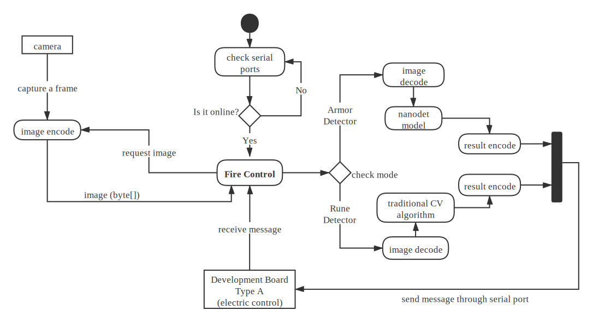
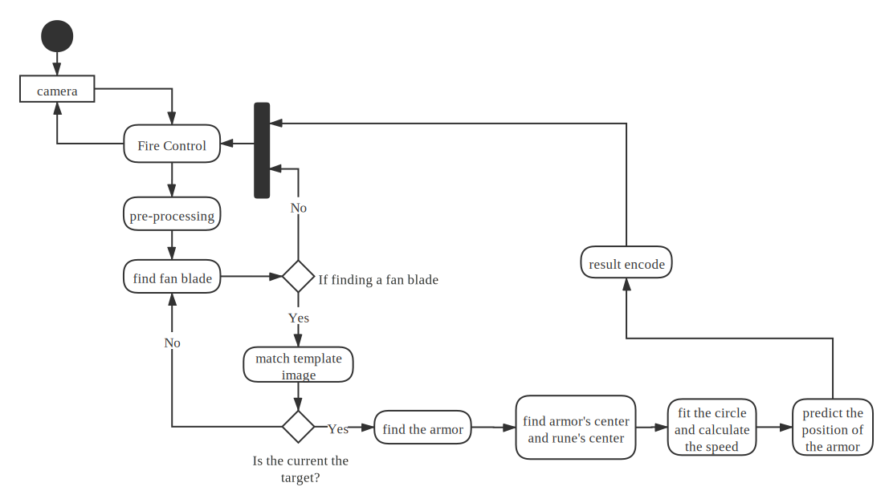

# Robomaster Vision

This repo is the vision system of Robomaster 2021 season developed by UoN-lancet. The main control and communication part is written with C#. The video stream is read by c++ dynamic link library file `libcapstream.so`  and separate to `cv::Mat` type and then encode to `byte[]`. Then the bytes array is send to main control system. The detector algorithm models are written in c++ and compiled as `libxxxdet.so`. The interface is a struct contains data length and data byte array. 

*To avoid environment and format problems, Please use a linux computer or a linux virtual machine when developing this project and pushing codes.*


==TODO: put images to show results==


## 



## File Structure

```
RobomasterVisionSystem
├── Communicator
|   ├── RobomasterVision.csproj
|   ├── RobomasterVision.sln
|   └── src
|       ├── ActionSyncRetry.cs
|       ├── Bytes.cs
|       ├── CommandFrame.cs
|       ├── CRC.cs
|       └── Program.cs
├── ArmorDetector
│   ├── CMakeLists.txt
│   ├── src
│   |   ├── config.h
│   |   ├── detector.cpp
│   |   ├── detector.h
│   |   ├── library.cpp
│   |   ├── library.h
│   |   ├── nanodet.cpp
│   |   └── nanodet.h
|   └── utils
│       └── visualize.h
├── EnergyDetector
│   ├── CMakeLists.txt
│   ├── src
│   |   ├── config.h
│   |   ├── rune.cpp
│   |   ├── rune.h
│   |   ├── detect.cpp
│   |   ├── detect.h
│   |   ├── library.cpp
│   |   └── library.h
|   └── utils
│       └── visualize.h
└── README.MD
```

## Requirements and environment

| Tested Hardware                    | OS                                                           | Env & Tools                                                  |
| ---------------------------------- | ------------------------------------------------------------ | ------------------------------------------------------------ |
| Intel NUC i7 <br> | Develop: Manjaro Linux 21.0.5<br>Testing: Ubuntu 20.04 LTS<br>Deploy: Debian Linux 10.0 | linux kernel >= 4.9<br>CMake >= 3.10<br>gcc 9.x/10.x<br>OpenCV >= 4.2<br>Dotnet == 5.0<br>NCNN<br>VulkanSDK >= 1.2<br>Pytorch >= 1.7 (train model) |

## Network performance analysis

<!doctype html>
<html>
<head>
<meta charset='UTF-8'><meta name='viewport' content='width=device-width initial-scale=1'>
<title></title></head>
<body><figure><table>
<thead>
<tr><th>Model</th><th>Model Size</th><th>Framework</th><th>Dataset</th><th>mAP</th><th>FPS (GTX1080Ti)</th><th>FPS (Intel i7)</th></tr></thead>
<tbody><tr><td>Yolo v4</td><td>640</td><td>Darknet</td><td>Roco 1080</td><td>24.6</td><td>40 - 60</td><td>0.5 - 0.7</td></tr><tr><td>Yolo v4 tiny</td><td>640</td><td>Darknet</td><td>Roco 1080</td><td>22.8</td><td>80 - 120</td><td>3 - 7</td></tr><tr><td>Nanodet</td><td>720</td><td>Pytorch NCNN</td><td>Roco 1080</td><td>21.3</td><td>110 - 140</td><td>12 - 18</td></tr><tr><td>Nanodet</td><td>720</td><td>Pytorch NCNN</td><td>Roco 1080<br>Roco 720</td><td>21.5</td><td>110 - 140</td><td>12 - 18</td></tr><tr><td>Nanodet</td><td>480</td><td>Pytorch NCNN</td><td>Roco 1080<br>Roco 720</td><td>20.4</td><td>130+</td><td>18 - 25</td></tr></tbody>
</table></figure>
<p>&nbsp;</p >
</body>
</html>

## OpenCV

```
root@debian~# apt install cmake gcc opencv-dev libopencv
root@arch~# pacman -S cmake gcc opencv
```

#### Dotnet

```
root@xxx~# snap install dotnet-sdk --classic
```

#### NCNN

​	https://github.com/Tencent/ncnn

#### Vulkan

​	https://www.khronos.org/vulkan/

## Communicator

Serial Port communicator


| Field | Offset   | Length (bytes) | Description                                          |
| ----- | -------- | -------------- | ---------------------------------------------------- |
| SOF   | 0        | 1              | Start of Frame, fixed to 0x05                        |
| DLEN  | 1        | 2              | Length of DATA, little-endian uint16_t               |
| SEQ   | 3        | 1              | Sequence number                                      |
| CRC8  | 4        | 1              | p = 0x31, init = 0xFF, reflect data &  remainder     |
| CMD   | 5        | 2              | Command, little-endian uint16_t                      |
| DATA  | 7        | DLEN           | Data                                                 |
| CRC16 | 7 + DLEN | 2              | p = 0x1021, init = 0xFFFF, reflect data  & remainder |


## Detectors Interface

C++

```cpp
#include "config.h"

#define EXPORT

extern "C"
{
	struct Result
    {
        uint32_t data_length = DATA_LENGTH;
        uint8_t data[DATA_LENGTH];
    }
    
    struct CvImageArray
    {
        uint8_t data[IMAGE_BUFFER_SIZE];
    }
}
```

```cpp
// library.cpp

#include "config.h"
#include "library.h"

extern "C"
{   
    EXPORT Result execute(CvImageArray imarray)
    {
        // code
    }
}
```

```c++
// config.h

#define BLU   0
#define RED   1

#define ENEMY_COLOR  BLU

#define IMAGE_SIZE         480
#define IMAGE_BUFFER_SIZE  ((IMAGE_SIZE * IMAGE_SIZE) << 1)

// ...
```


C#

```C#
namespace RobomasterVision 
{
    class SampleDetector
    {
        [StructLayout(LayoutKind.Sequential)]
        static struct Result
        {
            public readonly byte DataLength;
            [MarshalAs(UnmanagedType.ByValArray, SizeConst = DataLength)]
            public readonly byte[] data;
        }
        
        [StructLayout(LayoutKind.Sequential)]
        static struct CvImageArray
        {
            [MarshalAs(UnmanagedType.ByValArray, SizeConst = Config.IMAGE_BUFFER_SIZE)]
            public readonly byte[] data;
        }
        
        [DllImport("libdetector.so", EntryPoint = "detect")]
        static extern IResult Detect(CvImageArray imageArray);
        
        // ...
    }
}
```

```c#
// Config.cs
namespace RobomasterVision 
{
	class Config 
    {
        static const int IMAGE_SIZE        = 480;
        // buffer size is 2 times of sqare of image length
		static const int IMAGE_BUFFER_SIZE = (IMAGE_SIZE * IMAGE_SIZE) << 1; 
        // ...
	}
}
```


## Armor Detector

The armor detector part now uses 720x720 images to train and 480x480 images to perform detection.

Result: 18 - 20 fps

​		compiled as "libarmordet.so"

​		edit configure in "config.h"

### 		Model: Nanodet: https://github.com/RangiLyu/nanodet

## Naming Standard

​	ClassesAndInterfaces { }: PascalCase

​	cppfunctionsAndMethods(): camelCase

​	CSharpFunctionsAndMethods(): PascalCase

​	cppVariblesAndFields: camelCase

​	CSharpFields: PascalCase

​	csharpLocalVaribles: camelCase

​	pure_c_varibles: lower_case_with_underline

​	CONSTANTS_AND_MACROS: UPPER_CASE_WITH_UNDERLINE

## Tools

#### 	ImageLabeller

​		Used to label a set of images from video stream

#### 	Coco2Pas

​		Transfer coco xml format label to pascal format label

